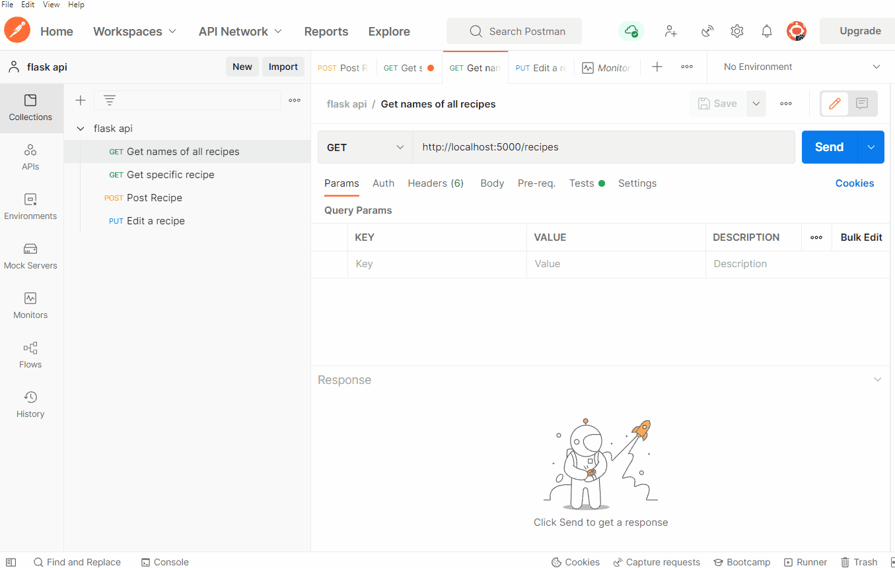

# flask-json-api

The goals of this project were simply to:
* Set up a virtual environment to run this project
* Create a flask json api that is able to accomplish several tasks as described on:
https://hatchways.notion.site/hatchways/Back-End-Practice-Assessment-0a110db665384575a94d93faab787f0e
Tasks Include:
    * [x] Build a GET route that returns all recipe names.
    * [x] Build a GET route that takes a recipe name as a string param. Return the ingredients and the number of steps in the recipe as JSON
    * [x] Add a POST route that can add additional recipes in the existing format to the backend with support for the above routes.
    * [x] Add a PUT route that can update existing recipes.
    * [x] Utilize unit tests

Testing done through Postman (downloaded version to test on local machine)
#

Some references:
* https://www.digitalocean.com/community/tutorials/how-to-install-python-3-and-set-up-a-local-programming-environment-on-windows-10
* https://auth0.com/blog/developing-restful-apis-with-python-and-flask/
* https://towardsdatascience.com/18-common-python-anti-patterns-i-wish-i-had-known-before-44d983805f0f
